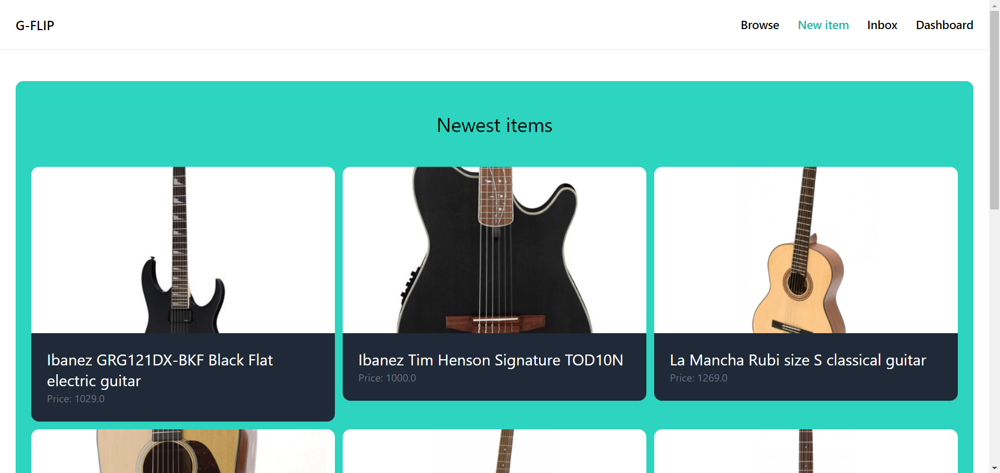

# G-Flip
### Screenshot

### Description
G-Flip is simple e-commerce app for flipping guitars.
### Tech stack
- Django
- TailWind CSS

### Installation
```powershell
./env/Scripts/activate
```

```powershell
cd projekt
```

```powershell
python -m manage runserver
```

```powershell
start http://127.0.0.1:8000/
```

### Passwords
- admin
  - login: admin
  - password: 123
